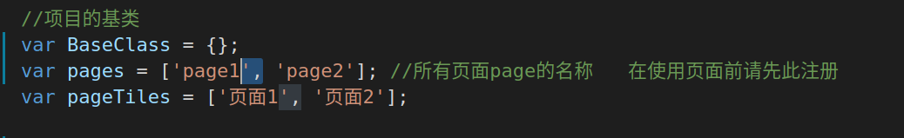
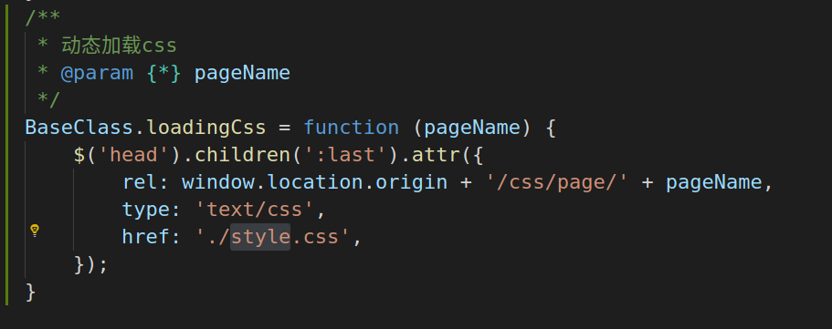

<h2 style="
    width: 100%;
    text-align:  center;
">基于jquery的单页面应用</h2>

1. ### 目录结构
    - css
        - [amazeui.min.css](http://amazeui.org/)
        - base.css (项目css)
    
    - fonts (amazeui字体文件)

    - img (本地图片)
    
    - js
        - base 
            - base.js (项目公共类)

        - page (module层)
            - page1.js (模块逻辑代码)

        - plug (所有用到的第三方js插件)

    - page (view层)
        - page1.html (模块视图层)

2. ### 使用说明
    - 只需将项目放置服务器上,然后访问index.html就可以.(请根据实际情况改变静态资源路径)
    - 该应用推荐新手使用,大佬请自行前往React, Vue, Angular    

3. ### 创建一个模块
    1. 创建一个view与Module(必需同名)
    2. 在base.js中注册该模块
    
    3. 模块间的跳转
    ```javascript
        BaseClass.changeHash('模块名称')
    ```


4. ### 注意事项
    - view层中一个page代码一个模块
    - module层中对应view层中的模块
    - view与module是对应关系,有view必需有module,并且同名!!!
    - 请不要随意更改base.js中的代码
    - module中的代码为动态加载  
    - base.css中包含了所有的style, 如果觉得不方便也可以使用动态加载css, 方法为:
    


5. ### 使用到的框架
    - [amazeui](http://amazeui.org/)
    - [jquery](http://jquery.cuishifeng.cn/)
    - 移动端下推荐使用
        - [zepto](http://www.css88.com/doc/zeptojs_api/)