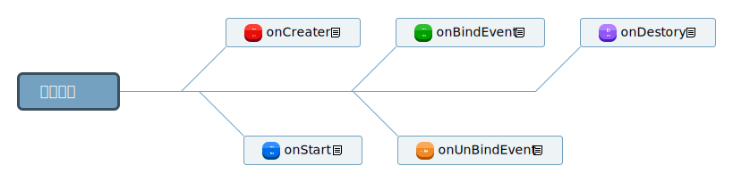

<h2 style="
    width: 100%;
    text-align:  center;
">基于jquery的单页面应用</h2>

[](https://standardjs.com)

[](https://www.npmjs.com/package/qs)
## 运行
```
    node的方式:

    1. npm install anywhere -g

    2. anywhere -f ./index.html
    
    其他方式:
    
    1. 只需将项目放置服务器上,然后访问index.html就可以.

    2  请根据实际情况改变静态资源路径

    发布:

    1. let developmentPath = '线上静态资源根目录'
   
    注: 如果不考虑兼容与优化可以不执行以下步骤
    2. let development = true; (在base.js中)
    
    3. npm i
    
    4. npm run build 

```

1. ### 目录结构

    ```
    qs
    │   README.md
    │   gulpfile.js  
    │   package.json   
    │   index.html   
    │      
    └───css
    │   │   amazeui.min.css
    │   │   base.css (项目css)  
    │    
    └───js
    │   └───base
    │   │      base.js (项目公共类)
    │   │        
    │   └───page (module层)
    │   │      page1.js
    │   │    
    │   └───plug (所有用到的第三方js插件)
    │   
    └───page (view层)
    │   │   page1.html 
    │ 
    └───fonts (amazeui字体文件)
    └───img (本地图片)
    └───src (打包后的代码)
    ```

2. ### 使用说明
    - npm run test （此方式可检查所有js代码是否规范， 当然也可以使用 standard filename.js）
    - 该应用推荐新手使用,大佬请自行前往React, Vue, Angular    

3. ### 创建一个模块
    - 创建一个view与Module(必需同名)
    - 在base.js中注册该模块
    - Module中创建的类需要继承ControllerActivity  类名为: 模块名(首字母大写) + Activity
    ```javascript
        let pages = ['page1', 'page2']; //所有页面page的名称   在使用页面前请先此注册
        let pageTiles = ['页面1', '组件的使用'];
    ```

    - 模块间的跳转

    ```javascript
        BaseClass.changeHash('模块名称', {key: 'value'});
        
        //接收发送的消息
        let handleData = BaseClass.getPageHandler('当前模块名称');
    ```


4. ### 注意事项
    - view层中一个page代码一个模块
    - module层中对应view层中的模块
    - view与module是对应关系,有view必需有module,并且同名!!!
    - 请不要随意更改base.js中的代码
    - module中的代码为动态加载  
    - base.css中包含了所有的style, 如果觉得不方便也可以使用动态加载css, 方法为:

    ```javascript
        loadingCss(pageName) {
            $('head').children(':last').attr({
                rel: window.location.origin + '/css/page/' + pageName,
                type: 'text/css',
                href: './style.css'
            });
        };
    ```

    - 在页面跳转时请不要使用a标签

5. ### 常用组件
    注:所有组件在[page2](https://github.com/schizobulia/qs/blob/master/js/page/page2.js)中有具体的使用代码
    - uploadImg (多图上传组件代码)
    - toast (提示信息)
    - loadingDailog (加载动画)
    - notification (通知栏)
    - [好多组件amazeui已经提供](http://amazeui.org/widgets?_ver=2.x)

6. ### 使用到的框架
    - [amazeui](http://amazeui.org/)
    - [jquery](http://jquery.cuishifeng.cn/)
    - 移动端下推荐使用
        - [zepto](http://www.css88.com/doc/zeptojs_api/)

7. ### 基类说明 
    - #### ControllerActivity 

    

8. ### 项目地址
    －  https://www.tyessc.com/qs
    ##### 注：线上地址因为加入pwa的原因有时会有错误,那是google的问题，不会影响整体运行．


##### 有兴趣一起写的同学可以邮箱联系本人